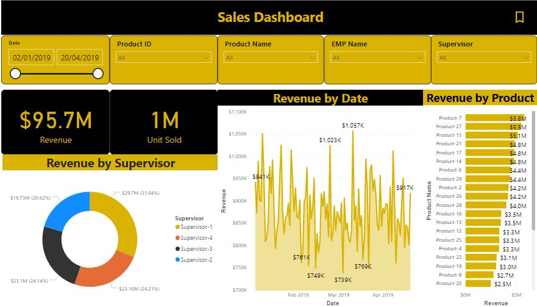

# End-to-End-Sales-Data-Dashboard
## Objectives: 

  I have figured the individual and collective contribution of each product, employee and supervisor to the overall internal sales generated by the company.

## Steps to achieve Objective:

•	Clean and transform the dataset to make it more reliable.

•	Establish relationships between all tables.

•	Create filters to drill down based upon product and employee.

•	Determine sales by revenue and number of units sold.

•	Determine the revenue generated under each supervisor.

•	Diagnose daily growth in revenue.

•	Determine individual products revenue.

•	Create a drill down table with relevant columns.

•	Incorporate easy buttons for better UX.
